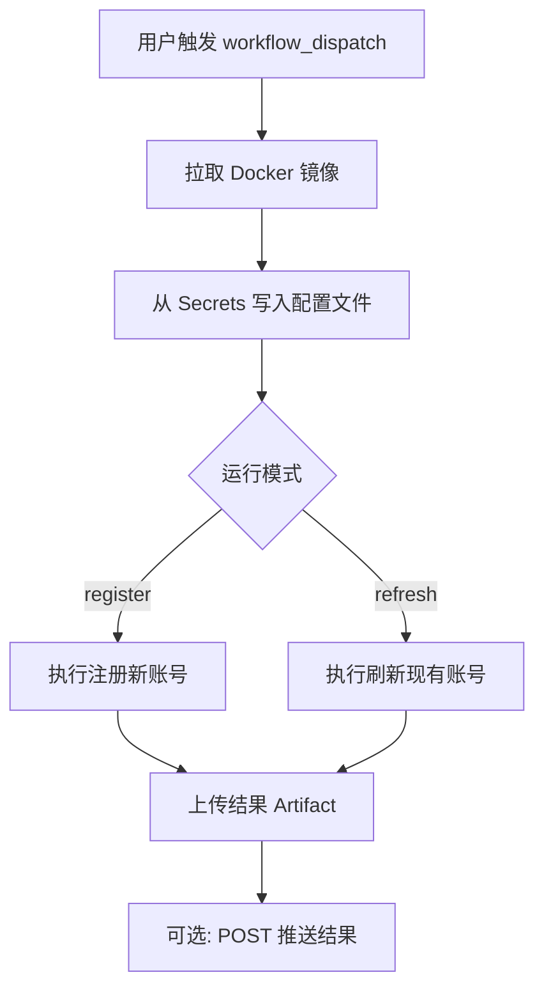

# GitHub Actions Docker 执行工作流实施计划

为项目添加 GitHub Actions 工作流，让其他用户可以 Fork 仓库后，通过 Actions 界面手动触发 Docker 容器来执行账号操作。

## User Review Required

> [!IMPORTANT]
> **敏感信息存储方案**：Clash 配置（`local.yaml`）包含代理节点信息，建议用户将其存储在 GitHub Secrets 中，工作流运行时动态写入。请确认此方案是否可接受。

> [!WARNING]
> **运行时间限制**：GitHub Actions 免费版有 6 小时运行时间限制。单账号处理约需 1-2 分钟，请注意控制批量处理数量。

> [!CAUTION]
> **账号安全**：result.csv 中的账号密码信息较敏感，建议通过 Secrets 传递而非直接提交到仓库。

---

## 设计方案

### 工作流触发方式

1. **手动触发** (`workflow_dispatch`)：用户在 Actions 页面输入参数
2. **定时触发** (`schedule`)：每 6 小时自动运行刷新模式

| 输入参数 | 类型 | 描述 | 默认值 |
|---------|------|------|--------|
| `mode` | choice | 运行模式：register (注册新账号) / refresh (刷新现有账号) | `refresh` |
| `account_count` | number | 注册模式下创建账号数量 | `1` |

### Secrets 配置
用户需在仓库 Settings → Secrets 中配置：

| Secret 名称 | 描述 | 必需 |
|------------|------|------|
| `CLASH_CONFIG` | 完整的 Clash/Mihomo YAML 配置内容 | ✅ |
| `ACCOUNTS_CSV` | result.csv 内容（刷新模式需要） | 刷新模式需要 |
| `POST_TARGET_URL` | Cookie 推送目标地址 | ❌ 可选 |

### 工作流执行流程


---

## Proposed Changes

### GitHub Actions Workflows

#### [NEW] [run-gemini.yml](file:///Users/evan/Documents/seafile/Seafile/00_Dev/Github/refresh-gemini-business/.github/workflows/run-gemini.yml)

创建新的手动触发工作流，包含：
- `workflow_dispatch` 配置，定义用户输入参数
- 拉取预编译的 Docker 镜像
- 从 Secrets 动态生成配置文件
- 运行 Docker 容器执行操作
- 将 `accounts.json` 结果上传为 Artifact

```yaml
name: Run Gemini Business Tool

on:
  workflow_dispatch:
    inputs:
      mode:
        description: '运行模式'
        required: true
        default: 'refresh'
        type: choice
        options:
          - refresh
          - register
      account_count:
        description: '注册账号数量 (仅 register 模式)'
        required: false
        default: '1'
        type: string
      specific_email:
        description: '指定刷新的邮箱 (可选，为空处理全部未处理账号)'
        required: false
        type: string
      proxy_node:
        description: '指定代理节点名称 (可选)'
        required: false
        type: string
```

---

### Documentation

#### [MODIFY] [README.md](file:///Users/evan/Documents/seafile/Seafile/00_Dev/Github/refresh-gemini-business/README.md)

在 README 中添加 **GitHub Actions 使用指南** 章节：
- Fork 仓库步骤
- Secrets 配置说明
- 如何触发工作流
- 如何下载结果文件
- 常见问题解答

---

## Verification Plan

### Automated Tests

1. **工作流语法验证**
   ```bash
   # 安装 actionlint
   brew install actionlint
   # 验证工作流语法
   actionlint .github/workflows/run-gemini.yml
   ```

### Manual Verification

1. **用户手动测试**：
   - 将仓库推送到 GitHub
   - 配置必要的 Secrets
   - 在 Actions 页面手动触发工作流
   - 验证 Docker 容器正确运行
   - 下载并检查输出的 Artifact

> [!NOTE]
> 由于工作流需要真实的代理节点和邮件服务，完整测试需要用户在实际环境中执行。
